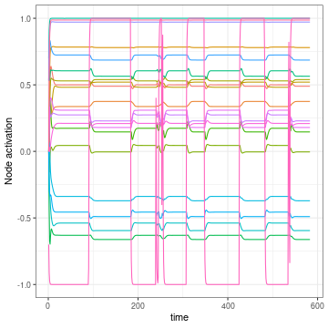
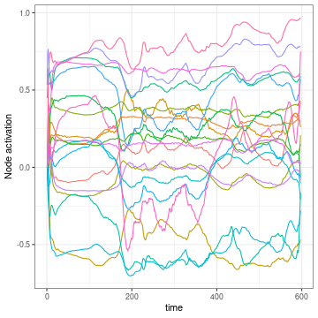
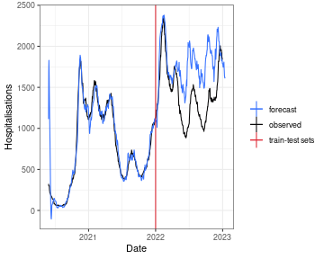

```r
library(reservoirnet)
library(ggplot2)
library(dplyr)
```

# Goal

Here you will learn basic use of reservoirnet package. This will be illustrated with the covid-19 dataset included in the pakage. Those data contain the hospitalisations, positive RT-PCR an IPTCC from the Bordeaux Hospital. The data below 10 have been set to 0 for privacy issues. Our goal will be to forecast the number of hospitalised patients 14 days ahead. To do so, we will first learn on data prior to 2021-07-01 and forecats on the following data.

We can load the data and set the given task :


```r
data("dfCovid")

dist_forecast = 14

traintest_date = as.Date("2022-01-01")
```

# Covid-19 data

Because both RT-PCR have strong variations, we will first proceed by taking the moving average on the last 7 days of those features. Also we add an outcome and an outcomeDate colum which will be useful to train the model.


```r
dfOutcome <- dfCovid %>%
  # outcome at 14 days
  mutate(outcome = lead(x = hosp, n = dist_forecast),
         outcomeDate = date + dist_forecast) %>%
  # rolling average for iptcc and positive_pcr
  mutate_at(.vars = c("Positive", "Tested"),
            .funs = function(x) slider::slide_dbl(.x = x,
                                                  .before = 6,
                                                  .f = mean))
```

Now that we have our data ready, we can plot those :


```r
dfOutcome %>%
  tidyr::pivot_longer(cols = c("hosp", "Positive", "Tested")) %>%
  ggplot2::ggplot(mapping = aes(x = date, y = value)) +
  geom_line() +
  facet_grid(name ~ ., scales = "free_y") +
  theme_bw() +
  geom_vline(mapping = aes(color = "train-test sets", xintercept = traintest_date)) +
  labs(color = "") +
  theme(legend.position = "bottom")
```


The data looks good, let's start our first reservoir !

# First reservoir

Setting a reservoir is easily done with the `createNode()` function. The important hyperparameters are the following :

- Number of nodes (units) : it corresponds to the number of nodes inside the reservoir. Usually, the more the better but more nodes increase the computation time. 
- Leaking rate (lr) : the leaking rate corresponds to the balance between the new inputs and the previous state. A leaking rate of 1 only consider informations from the new inputs.
- Spectral radius (sr): the spectral radius is the maximum absolute eigenvalue of the reservoir connectivity matrix. A small spectral radius induces stable dynamics inside the reservoir, a high spectral radius induces chaotic regimen inside the reservoir.
- Input scaling (input_scaling): the input scaling is a gain applied to the input features of the reservoir.


```r
reservoir <- reservoirnet::createNode(nodeType = "Reservoir",
                                      seed = stand_seed,
                                      units = 500,
                                      lr = 0.7,
                                      sr = 1,
                                      input_scaling = 1)
```

Then we can feed the data to the reservoir and see the activation depending on time of the reservoir. To do so, we first prepare the data and transform it to an array.


```r
## select explanatory and transform it to an array
X <- dfOutcome %>%
  filter(outcomeDate < traintest_date) %>%
  select(hosp, Positive, Tested) %>%
  as.matrix() %>%
  as.array()
```

Then we run the `predict_seq` function. The parameter reset is set to TRUE to be sure that the node is clear from data (it is optional here).


```r
reservoir_state <- predict_seq(node = reservoir, X = X, reset = TRUE)
```

Now we might want to visualise it so we can make a plot of this :


```r
plot(reservoir_state)
```



We see a lot of nodes with a steady state after time 100 and do not move after that. It will be really difficult for the ridge output layer to learn on this node because they present nearly no information. The problem is caused by the different scales of the features, to take this into account, we can divide by the maximum value :


```r
stand_max <- function(x) return(x/max(x))
```

We prepare the scaled data, feed them to the reservoir and plot the node activation.


```r
# scaled features
Xstand <- dfOutcome %>%
  filter(date < traintest_date) %>%
  select(hosp, Positive, Tested) %>%
  mutate_all(.funs = stand_max) %>%
  as.matrix() %>%
  as.array()
# feed them to the reservoir
reservoir_state_stand <- predict_seq(node = reservoir, X = Xstand, reset = TRUE)
# plot the output
plot(reservoir_state_stand)
```



The reservoir dynamics now look much better as no node seem to get saturated.

# Forecast

In order to train the reservoir, we should train the last layer which linearly combines the neuron's output.

## Set the ESN

First we define this last layer with a ridge penalty of 0.1.


```r
readout <- reservoirnet::createNode(nodeType = "Ridge", ridge = 0.1)
```

And we connect it to the previously defined reservoir :


```r
model <- reservoirnet::link(reservoir, readout)
```

The model is now ready we must now train the last layer weights.

## Set the data

First we separate the train set on which we will learn the ridge coefficients and the test set on which we will make the forecast :


```r
# train set
yTrain <- dfOutcome %>% filter(outcomeDate <= traintest_date) %>% select(outcome)
xTrain <- dfOutcome %>% filter(outcomeDate <= traintest_date) %>% select(hosp, Positive, Tested)
# test set
xTest <- dfOutcome %>% select(hosp, Positive, Tested)
```

We now standardise with the same formula as seen before. We learn the standardisation on the training set :


```r
# standardise based on training set values
ls_fct_stand <- apply(xTrain,
                      MARGIN = 2,
                      FUN = function(x) function(feature) return(feature/(max(x))))
```

And we apply it to both the train and test sets :


```r
xTrainstand <- xTrain
xTeststand <- xTest
lapply(X = names(ls_fct_stand),
       FUN = function(x){
         xTrainstand[,x] <<- ls_fct_stand[[x]](feature = xTrain[,x])
         xTeststand[,x] <<- ls_fct_stand[[x]](feature = xTest[,x])
         return()
       })
```

Finally we convert all those data to array :


```r
# convert to array
lsdf <- lapply(list(yTrain = yTrain,
                    xTrain = xTrainstand,
                    xTest = xTeststand),
               function(x) as.array(as.matrix(x)))
```

Et voilà !

## Train the model and predict

Now, the easy part. We are going to train the reservoir with the train set. To do so, we set a warmup of 30 days during which the data are propagating into the reservoir but not used to fit the ridge layer.


```r
### train the reservoir ridge output
fit <- reservoirnet::reservoirR_fit(node = model, X = lsdf$xTrain, Y = lsdf$yTrain, warmup = 30, reset = TRUE)
```

Now that the ridge layer is trained, we can perform predictions as seen before. We set the parameter `reset` to TRUE in order to clean the reservoir from the data used by the training set.


```r
### predict with the reservoir
vec_pred <- reservoirnet::predict_seq(node = fit$fit, X = lsdf$xTest, reset = TRUE)
```


```r
dfOutcome %>%
  mutate(pred = vec_pred) %>%
  ggplot(mapping = aes(x = outcomeDate)) +
  geom_line(mapping = aes(y = outcome, color = "observed")) +
  geom_line(mapping = aes(y = pred, color = "forecast")) +
  geom_vline(mapping = aes(color = "train-test sets", xintercept = traintest_date)) +
  scale_color_manual(values = c("#3772ff", "#080708", "#df2935")) +
  theme_bw() +
  labs(color = "", x = "Date", y = "Hospitalisations")
```



We can see on the graph that during the learning set, the model forecast is superposed with the observed values which is expected. During the test set, the model first fit to the curve but quickly diverge from the observed values. This problem could be limitated by retraining the ridge curve on a weekly or daily basis but we will stop here for this vignette
